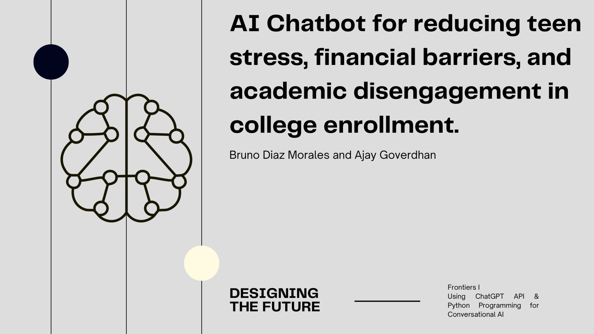
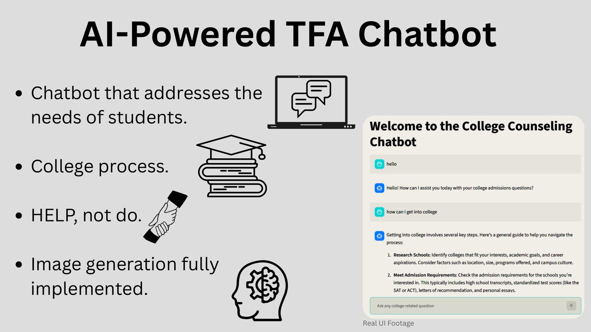
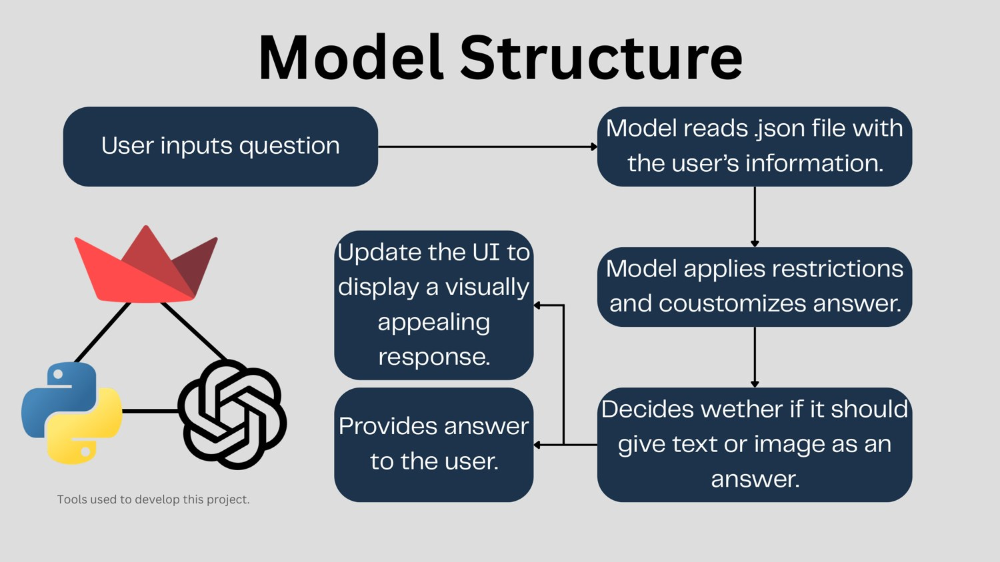

# AI College Counselor Chatbot

**WPI Frontiers 2026 - Major Project**  
**Course:** Using ChatGPT API and Python Programming for Conversational AI  
**Program dates:** July 5-19, 2026  
**Team:** Ajay Goverdhan and Bruno Diaz Morales

> This repository is a portfolio-safe version of the WPI Frontiers course project. It removes private secrets and avoids publishing the original team slide that included current school/location/age details.



## Project idea

The team explored how conversational AI could help students navigate barriers in the college-enrollment process. The presentation identified issues such as lack of resources, stress and uncertainty, financial barriers, test grades, heavy workloads, and lack of time.

The project goal was to create a **support tool** for the college process - something students could use alongside other resources, not a replacement for counselors or official college information.

## What the prototype does

The Streamlit application can:

- answer college-admissions questions through a conversational interface;
- load an optional JSON student profile and use it as context when relevant;
- maintain chat history during the Streamlit session;
- apply a system prompt that focuses the assistant on guidance rather than doing application work for the student;
- generate an image when the user explicitly starts a request with `!image`;
- clear the conversation and return to the initial counselor/profile context.



## Project workflow

1. The student enters a question.
2. The application reads a `.json` student profile.
3. The model applies restrictions and personalizes the answer.
4. The application determines whether the request is for text or an image.
5. The model returns a response.
6. Streamlit displays the response in the user interface.



See [`docs/ARCHITECTURE.md`](docs/ARCHITECTURE.md) for a code-oriented version of the workflow.

## Example use cases shown in the presentation

- extracurricular suggestions based on a student's profile;
- college support programs and accommodations;
- image-based comparisons/rankings related to computer-science colleges;
- a side-by-side WPI vs. Georgia Tech college-comparison infographic.

See [`docs/TEST_CASES.md`](docs/TEST_CASES.md).

## Technology

- Python
- Streamlit
- OpenAI API
- Pillow (PIL)
- JSON

## Run locally on Windows

```powershell
python -m venv .venv
.\.venv\Scripts\Activate.ps1
python -m pip install -r requirements.txt
Copy-Item student_profile.example.json student_profile.json
$env:OPENAI_API_KEY="YOUR_KEY_HERE"
streamlit run app.py
```

Edit `student_profile.json` locally if desired. It is excluded by `.gitignore` so private student information is not committed.

## Responsible-use notes

This was a course prototype, not a professional admissions service. Important facts such as deadlines, tuition, financial aid, accessibility accommodations, academic programs, and admissions requirements should be verified with official college sources.

AI-generated charts or college comparisons should be treated as demonstrations unless their underlying data has been independently verified.

## Presentation

A copy is included at:

[`docs/WPI_Frontiers_2026_AI_College_Counselor_Public_Presentation.pdf`](docs/WPI_Frontiers_2026_AI_College_Counselor_Public_Presentation.pdf)

## Credits

This was a **team project by Ajay Goverdhan and Bruno Diaz Morales** during WPI Frontiers 2026. See [`CREDITS.md`](CREDITS.md).

## Security

The original classroom source contained an API credential directly in the Python file. This portfolio version removes it and reads `OPENAI_API_KEY` from the environment.

## Presentation Video

Watch our final WPI Frontiers 2026 project presentation:

[▶ Watch / Download the Presentation Video](https://github.com/anadromous19/WPI-Frontiers-2026-AI-College-Counselor/releases/download/v1.0/WPI-Frontiers-2026-AI-College-Counselor-Presentation.mov)

**Presenters:** Ajay Goverdhan and Bruno Diaz Morales  
**Professor:** Chun-Kit Ngan  
**Course:** Using ChatGPT API and Python Programming for Conversational AI  
**WPI Frontiers 2026**
