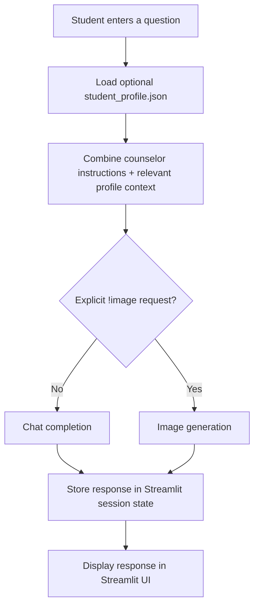

# Architecture

The presentation's model-structure slide shows a sequence from user question -> student JSON profile -> restrictions/personalization -> text-or-image decision -> answer -> UI display.

## Components

- **Streamlit UI:** chat input, message display, image display, and clear-conversation control.
- **Student profile:** optional local JSON context.
- **Counselor instructions:** focus on guidance and avoid writing application submissions for students.
- **Text generation:** normal questions are sent through the chat path.
- **Image generation:** requests beginning with `!image` use the image path.
